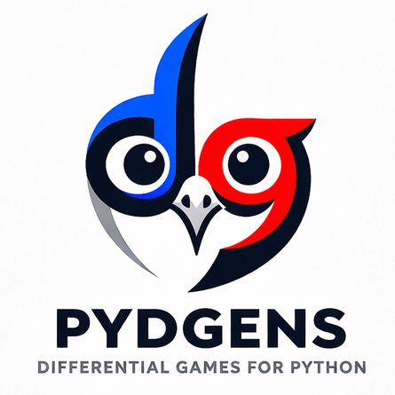
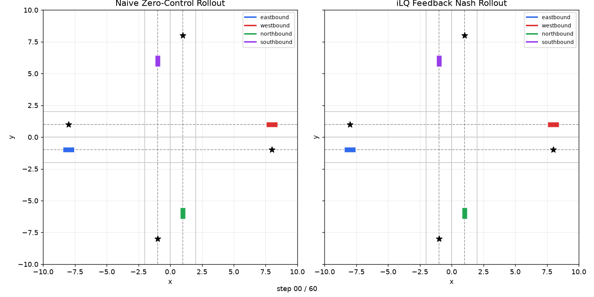

# PYDGENS: Python/JAX Differential Game Equilibria Numerical Solvers

<p align="center">
  
</p>

PYDGENS provides numerical solvers for approximating equilibrium solutions in multi-player, general-sum dynamic and differential games. The package currently focuses on linear-quadratic feedback Nash games, iterative linear-quadratic methods for nonlinear games, and augmented-Lagrangian workflows for constrained games.

PYDGENS is a pre-`1.0` release. The package is ready for early adopters, but the public API may continue to evolve as the modeling frontend, examples, and solver interfaces mature.

<table>
  <tr>
    <td width="72%">
      
    </td>
    <td width="28%">
      <strong>Multi-car intersection</strong>
      <br><br>
      Naive collisions compared to an iLQ feedback solution.
      <br><br>
      <a href="src/pydgens/examples/multi_car_intersection.py">Source</a> ·
      <a href="https://mit-ll.github.io/pydgens/examples/#multi-car-intersection">Docs</a>
    </td>
  </tr>
  <tr>
    <td width="72%">
      
    </td>
    <td width="28%">
      <strong>Satellite Lady-Bandit-Guard</strong>
      <br><br>
      One LQ feedback Nash strategy rolled out from many initial states.
      <br><br>
      <a href="src/pydgens/examples/satellite_lady_bandit_guard.py">Source</a> ·
      <a href="https://mit-ll.github.io/pydgens/examples/#satellite-lady-bandit-guard">Docs</a> ·
      <a href="https://github.com/mit-ll/spacegym-kspdg">spacegym-kspdg</a>
    </td>
  </tr>
</table>

## Installation

```bash
pip install pydgens
```

PYDGENS requires Python `3.12` or newer.

## Solvers

PYDGENS currently supports three main solver paths:

- LQ: linear-quadratic, unconstrained games solved for feedback Nash strategies
- iLQ: nonlinear, unconstrained games solved for local feedback Nash strategies
- AL: constrained nonlinear games solved with an augmented-Lagrangian workflow for local open-loop trajectories (_pre-release, beta version_)

## Examples

Run a minimal linear-quadratic tug-of-war game solved with the LQ solver:

```bash
python -m pydgens.examples.tug_o_war
```

Run a nonlinear two-player unicycle game solved with the iterative LQ solver:

```bash
python -m pydgens.examples.unicycle
```

Run a constrained two-player integrator game solved with the augmented-Lagrangian solver:

```bash
python -m pydgens.examples.constrained_integrators
```

More examples, including advanced examples that make use of the intermediate representations (IR), are listed in the [examples documentation](https://mit-ll.github.io/pydgens/examples/).

## Documentation

Documentation is available at <https://mit-ll.github.io/pydgens/>.

## Development

For development from a local clone:

```bash
pip install -e .[full]
```

Contributors can also use `uv` for a reproducible environment:

```bash
uv sync --extra dev
source .venv/bin/activate
```

## Testing

Quick tests:

```bash
pytest tests/ -v -s -m "not slow"
```

Slow and benchmark-oriented tests:

```bash
pytest tests/ -v -m "slow" --benchmark-columns='mean, min, max, stddev, rounds'
```

## Disclaimer

DISTRIBUTION STATEMENT A. Approved for public release. Distribution is unlimited.

This material is based upon work supported by the Under Secretary of War for Research and
Engineering under Air Force Contract No. FA8702-15-D-0001 or FA8702-25-D-B002. Any
opinions, findings, conclusions or recommendations expressed in this material are those of
the author(s) and do not necessarily reflect the views of the Under Secretary of War for
Research and Engineering.

© 2026 Massachusetts Institute of Technology.

Subject to FAR52.227-11 Patent Rights - Ownership by the contractor (May 2014)

SPDX-License-Identifier: MIT

The software/firmware is provided to you on an As-Is basis.

Delivered to the U.S. Government with Unlimited Rights, as defined in DFARS Part
252.227-7013 or 7014 (Feb 2014). Notwithstanding any copyright notice, U.S. Government
rights in this work are defined by DFARS 252.227-7013 or DFARS 252.227-7014 as detailed
above. Use of this work other than as specifically authorized by the U.S. Government may
violate any copyrights that exist in this work.
